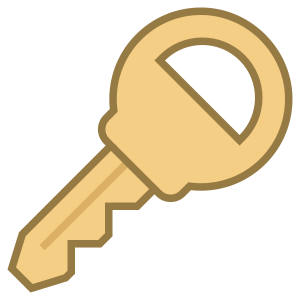

<div align="center">
  
</div>

# Generate Password

`generate-password` is a small, simple CLI utility that generates a strong password and copies it to the clipboard for easy, immediate access. Whenever you need a strong password, just run `generate-password` and voila. Done. Paste away.

```
Usage:
  generate-password [-u] [-m] [-n] [-s] [-l <length>] [-c] [options]

Options:
  -u, --no-uppercase             Exclude uppercase letters. (default: false)
  -m, --no-minuscule             Exclude miniscule/lowercase letters. (default: false)
  --no-lowercase                 Another name for -m or --no-minuscule. (default: false)
  --no-miniscule                 Common typo for --no-minuscule. (default: false)
  -n, --no-numbers               Exclude numbers. (default: false)
  -s, --no-symbols               Exclude special symbols. (default: false)
  -l <length>, --len <length>    Password length (default: 12).
  -c, --dont-copy                Don't copy the password to the clipboard. (default: false)
  -h, --help                     Show this help message and exit.

Examples:
  $ generate-password
  TEm{m3{;Csvm

  $ generate-password -s -l 4
  Va9U

  $ generate-password -s -l 8 -c
  BxSuSL14  # Not copied to the clipboard.
```

Shortcut options:

* `-u`  Exclude uppercase letters. Default uppercase included.
* `-m`  Exclude lowercase letters. Default lowercase included.
* `-n`  Exclude numbers. Default numbers included.
* `-s`  Exclude special symbols. Default symbols included.
* `-c`  Don't copy the password to the clipboard. Default password copied.
* `-l`  Password length. Default 12.

At least one character from every included character set is used in the
generated password. For example, if run with `-u` to exclude uppercase
characters

```
generate-password -u -l 3
```

then the generated password will include at least one lowercase letter,
at least one number, and at least one symbol.

```
a5!
```

This is useful for password requirements like `Must include at least one
number`, `Must include at least one special character`, etc.`

### Install Generate Password

Installing `generate-password` is easy.

```
pip install generate-passwd
```